# Adulti

<!-- markdownlint-disable MD033 -->
<p align="center">
  
</p>
<!-- markdownlint-enable MD033 -->

Adulti is a mobile-first personal finance app that helps early-career adults understand where their money stands and what to do next.

[](https://play.google.com/store/apps/details?id=com.larrylaa.adulti)

The product is built around clarity:

- See core balances quickly
- Follow a prioritized roadmap
- Learn concepts in plain language tied to real actions

## MVP Features

- Financial snapshot: checking, savings, debt, and investments
- Personalized roadmap with prioritized next steps
- Progress tracking with completion states
- Quick Learn context on roadmap tasks
- Full guide articles for deeper learning
- Debt tracking with multiple entries (card/loan + balance)
- Savings goal tracking and emergency-fund progress
- Investment tracking (401k, IRA, HSA, brokerage)
- Generic roadmap flow with "You are here" highlighting

## Tech Stack

- Flutter (Dart)
- Riverpod for app state
- Firebase Core/Auth/Firestore
- Firebase Analytics
- Android Gradle (Kotlin DSL)

## Project Structure

- `lib/`
  - `features/` feature-first UI modules (dashboard, roadmap, guide, onboarding, etc.)
  - `models/` domain models and roadmap logic
  - `providers/` Riverpod notifiers/providers
  - `services/` Firebase and analytics services
  - `widgets/` reusable shared widgets
- `android/`, `ios/`, `web/`, `windows/`, `linux/`, `macos/` platform targets

## Demo Gallery

The following screenshots are from the working app flow.


### Authentication

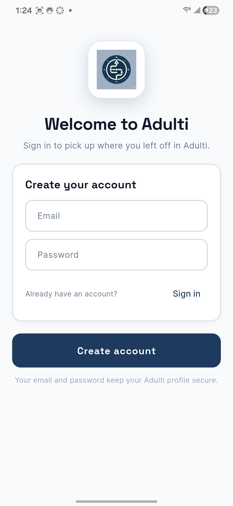
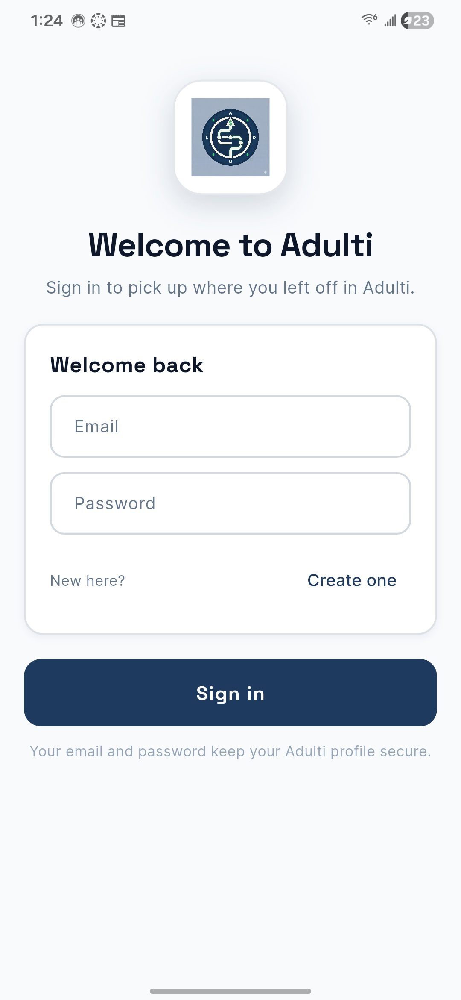

### Onboarding and Core Snapshot

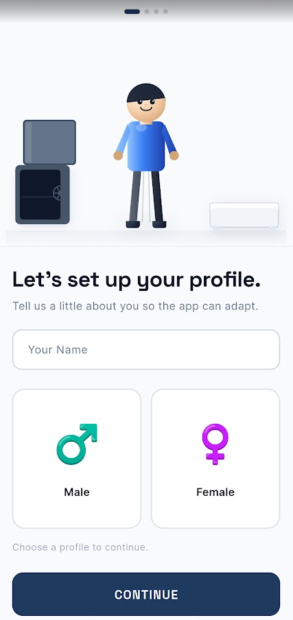
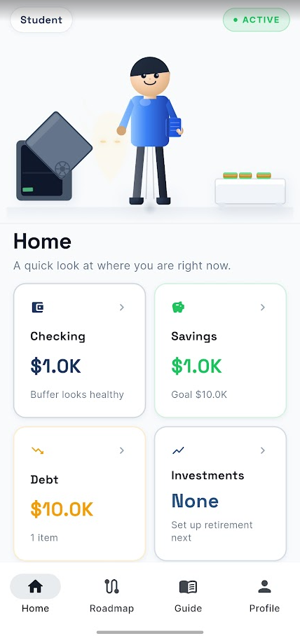
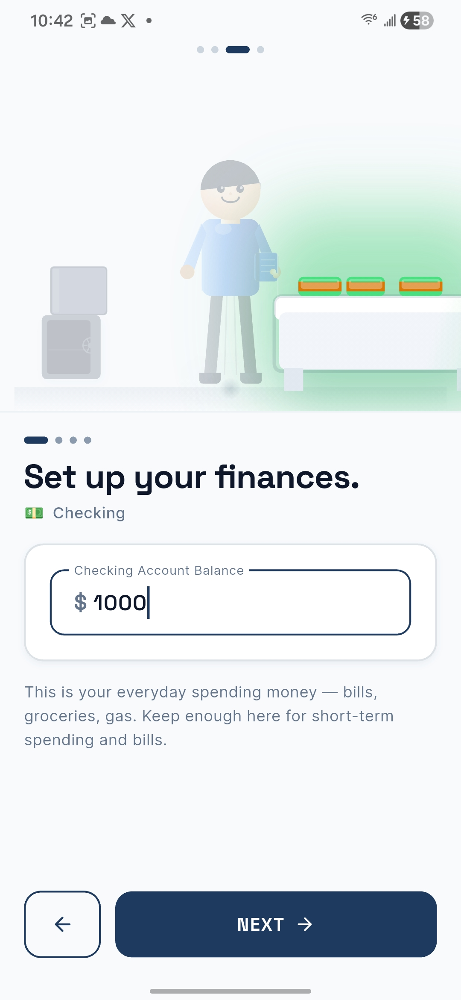

### Roadmap and Progress

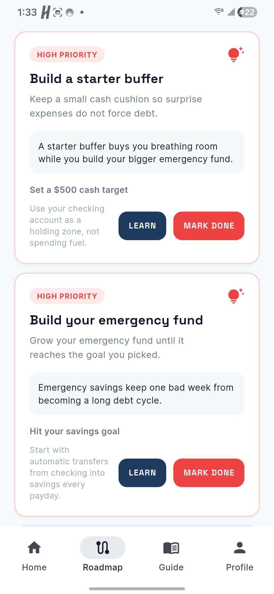
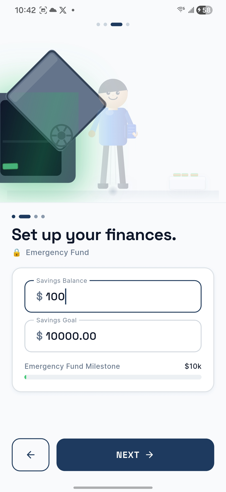
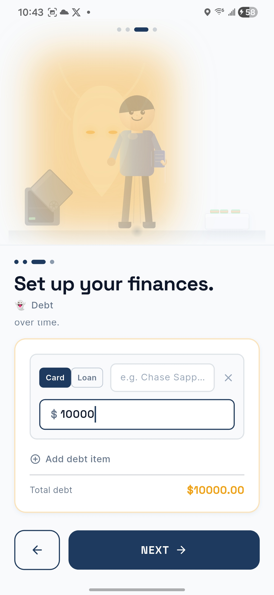
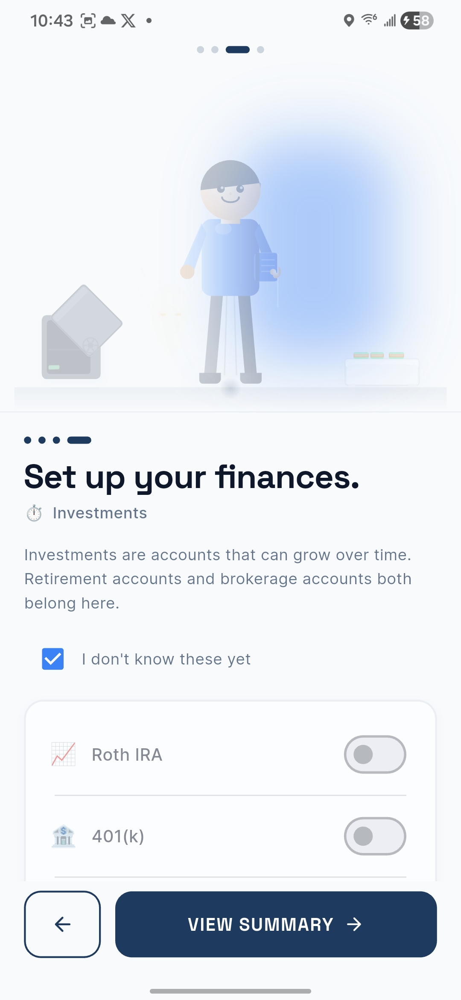
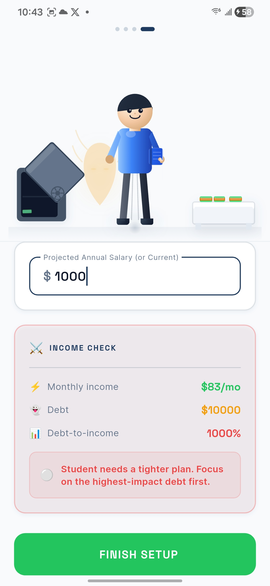

### Guide and Management Views

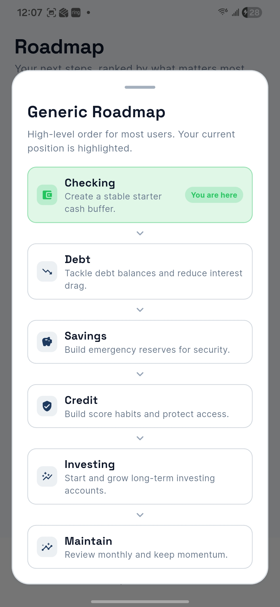
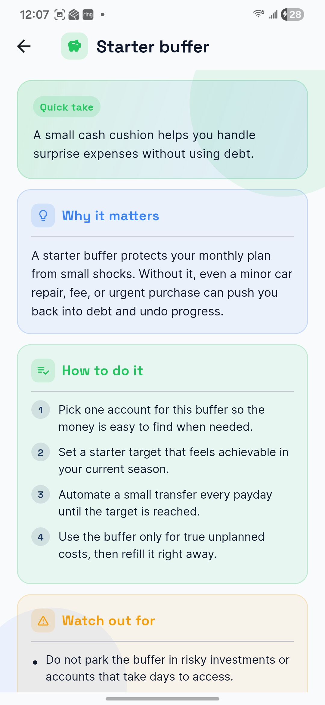
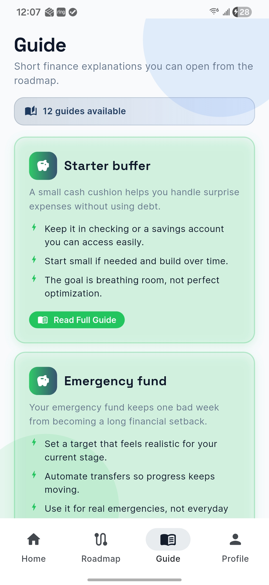
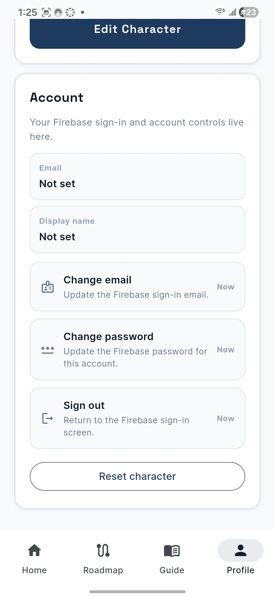

## Local Development

### Prerequisites

- Flutter SDK installed
- Android Studio/Xcode toolchains configured
- Firebase project configured for your app IDs

### Run Locally

```bash
flutter pub get
flutter analyze
flutter run
```

## Build and Deployment

### Android Play Store (AAB)

1. Create an upload keystore.
2. Configure signing values in `android/key.properties` (use `android/key.properties.example` as template).
3. Build release bundle:

```bash
flutter build appbundle --release
```

4. Upload output:

- `build/app/outputs/bundle/release/app-release.aab`

### Versioning

Set app version and build number in `pubspec.yaml`:

```yaml
version: 1.1.0+2
```
